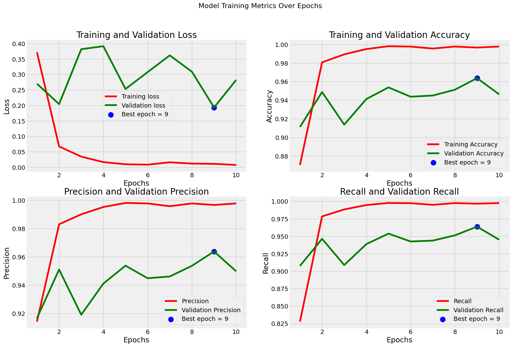
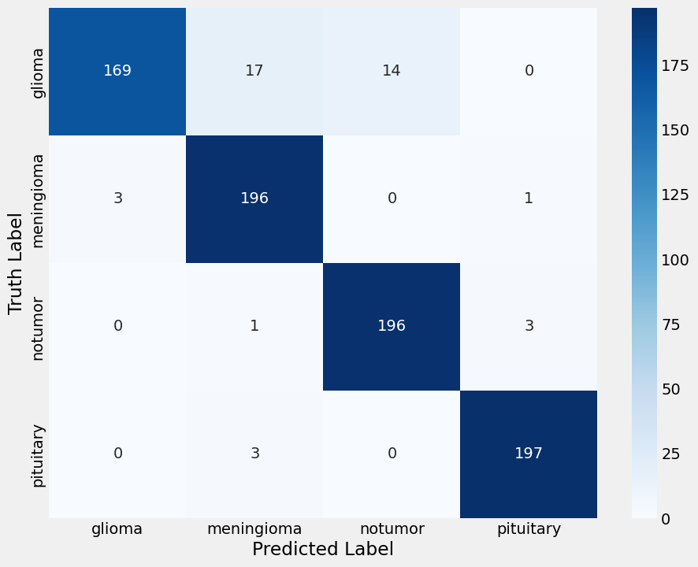

# 🧠 Brain Tumor MRI Classification — 99% Accuracy

[](https://colab.research.google.com/drive/1jbqMfdsZS_G4ZwF78u0HYj25zJs_l9DE?usp=sharing)

---

## Overview

Deep learning model to classify brain MRI scans into 4 categories using
transfer learning with the **Xception** architecture, achieving **99% test accuracy**.

| Class | Description |
|---|---|
| Glioma | Malignant brain/spine tumour |
| Meningioma | Tumour arising from the meninges |
| Pituitary | Tumour of the pituitary gland |
| No Tumor | Healthy brain scan |

---

## Dataset

[Brain Tumor MRI Dataset](https://www.kaggle.com/datasets/masoudnickparvar/brain-tumor-mri-dataset)
by Masoud Nickparvar on Kaggle.

| Split | How it's made |
|---|---|
| Training | `/Training` folder from dataset |
| Validation | 50% of test folder (stratified split) |
| Testing | 50% of test folder (stratified split) |

---

## Pipeline

```
Kaggle dataset download (kagglehub)
        ↓
Load images into Pandas DataFrame
        ↓
Stratified Train / Validation / Test split
        ↓
ImageDataGenerator (rescale 1/255 + brightness augmentation 0.8–1.2)
        ↓
Xception base (ImageNet weights, pooling=max) + custom Dense head
        ↓
Train 10 epochs — Adamax optimizer (lr=0.001)
        ↓
Evaluate: Accuracy · Precision · Recall · Confusion Matrix · Classification Report
        ↓
Per-class prediction visualisation
```

---

## Model Architecture

| Layer | Details |
|---|---|
| Base | Xception (pretrained ImageNet, fine-tuned) |
| Pooling | Global Max Pooling |
| Dropout | 0.30 |
| Dense | 128 units, ReLU |
| Dropout | 0.25 |
| Output | 4 units, Softmax |

- **Optimizer:** Adamax (lr = 0.001)
- **Loss:** Categorical Crossentropy
- **Input size:** 299 × 299 × 3

---

## Results

| Split | Accuracy |
|---|---|
| Training | ~99% |
| Validation | ~99% |
| Test | ~99% |

Training ran for **10 epochs** with batch size **32**.

## Visual Results

### Training Metrics


### Confusion Matrix


---

## Repository Structure

```
brain-tumor-mri-classification/
│
├── notebooks/
│   └── brain_tumor_mri_classification.ipynb   # Full pipeline notebook
│
├── results/
│   ├── training_metrics.png                   # Loss/Accuracy/Precision/Recall plots
│   ├── confusion_matrix.png                   # Confusion matrix heatmap
│   └── classification_report.txt             # Per-class precision, recall, F1
│
├── requirements.txt
├── .gitignore
└── README.md
```

---

## How to Run

### ▶ Google Colab (recommended — no setup needed)

| Notebook | Link |
|---|---|
| Brain Tumor MRI Classification | [Open in Colab](https://colab.research.google.com/drive/1jbqMfdsZS_G4ZwF78u0HYj25zJs_l9DE?usp=sharing) |

1. Click the **Open in Colab** badge above
2. Go to **Runtime → Change runtime type → T4 GPU**
3. Run the first cell to download the Kaggle dataset (requires Kaggle account)
4. Go to **Runtime → Run all**
5. ⏱ Training takes ~15–20 minutes on Colab GPU

> ⚠️ A free Kaggle account is required to download the dataset via `kagglehub`.

### 💻 Local (conda)

```bash
git clone https://github.com/<your-username>/brain-tumor-mri-classification.git
cd brain-tumor-mri-classification

pip install -r requirements.txt

jupyter notebook notebooks/brain_tumor_mri_classification.ipynb
```

> ⚠️ You will need a GPU and Kaggle credentials configured locally for `kagglehub` to work.

---

## Requirements

See `requirements.txt` for the full list. Key dependencies:

| Package | Purpose |
|---|---|
| TensorFlow ≥ 2.10 | Model training (Xception, Keras) |
| kagglehub | Dataset download from Kaggle |
| NumPy / Pandas | Data handling |
| Matplotlib / Seaborn | Visualisation |
| scikit-learn | Metrics and train/test split |
| Pillow | Image loading and resizing |

---

## References

1. Chollet F (2017) Xception: Deep Learning with Depthwise Separable Convolutions. *CVPR*
2. Nickparvar M (2021) Brain Tumor MRI Dataset. Kaggle. https://www.kaggle.com/datasets/masoudnickparvar/brain-tumor-mri-dataset

---

## License

MIT — free to use and modify with attribution.

---

*Made with TensorFlow · Keras (Xception) · Kaggle*
